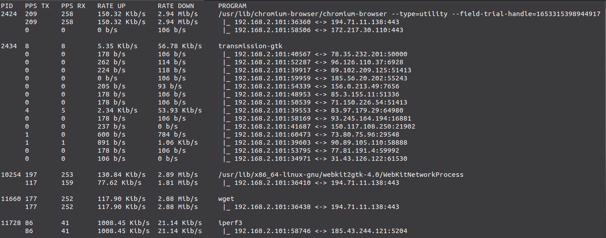

# Netproc

tool to monitor network traffic based on processes

#### [Dependences]
    [Debian based]
    $ sudo apt install libncurses5-dev

#### [Install]
    $ git clone https://github.com/berghetti/netproc.git
    $ cd netproc
    $ make
    $ sudo make install
   
##### Fast install
    $ git clone https://github.com/berghetti/netproc.git; cd netproc; make; sudo make install
    
#### [Options / usage]
    netproc - 0.2.0
    Usage: netproc [options]

    Options:
    -u            tracks udp traffic, default is tcp
    -i <iface>    specifies an interface, default is all
    -c            visualization each active connection of the process
    -B            view in bytes, default in bits
    -si           SI format display, with powers of 1000, default is IEC, with powers of 1024
    -h            show this message
    -v            show version    
#### [uninstall]
    $ sudo make uninstall
