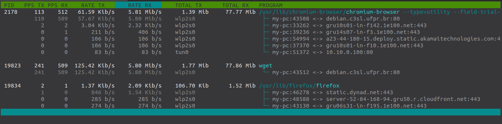

# Netproc

tool to monitor network traffic based on processes

#### [Dependences]
    [Debian based]
    $ sudo apt install gcc make libncurses5-dev

    [Red Hat Based]
    $ sudo yum install gcc make ncurses-devel

#### [Install]
    $ git clone https://github.com/berghetti/netproc.git
    $ cd netproc
    $ make
    $ sudo make install

##### Fast install
    $ git clone https://github.com/berghetti/netproc.git; cd netproc; make; sudo make install

#### [Options / usage]
    Usage: netproc [options]

    Options:
     -B            view in bytes, default in bits
     -c            visualization each active connection of the process
     -f "file"     save statistics in file, file name is optional, default is netproc.log
     -h            show this message
     -i <iface>    specifies an interface, default is all (except interface with network 127.0.0.0/8)
     -n            numeric host and service, implicit '-c',
                   try '-nh' to no translate only host or '-np' to not translate only service
     -p tcp | udp  specifies a protocol, the default is tcp and udp
     -si           SI format display, with powers of 1000, default is IEC, with powers of 1024
     -v            show version

    when running press:
     arrow keys    scroll
     s             change column-based sort
     q             exit

#### [uninstall]
    $ sudo make uninstall
